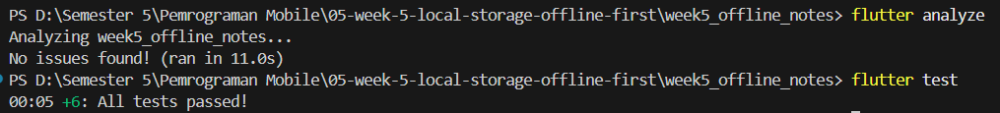

# PRAKTIKUM 3
## Gambar 1 Mengaktifkan Force Offline

Langkah: 
Pengujian diawali dengan membuka halaman Settings, kemudian mengaktifkan fitur Force Offline. Fitur ini digunakan untuk mensimulasikan kondisi aplikasi tanpa koneksi internet sehingga pengujian tidak bergantung pada kondisi jaringan yang tersedia. 

Hasil observasi: 
Setelah Force Offline diaktifkan, switch berubah menjadi ON. Kondisi tersebut menunjukkan bahwa aplikasi sedang disimulasikan dalam keadaan offline  

## Gambar 2 Menambahkan Catatan Saat Offline

Langkah: 
Setelah Force Offline aktif, pengguna kembali ke halaman Notes dan menambahkan catatan. Pada kondisi ini, catatan dibuat dan disimpan secara lokal meskipun aplikasi sedang berada dalam kondisi offline. 

Hasil observasi: 
Catatan berhasil ditambahkan dan ditampilkan pada halaman Notes. Pada bagian atas terlihat Notes - Dirty: 2, yang menunjukkan terdapat dua catatan yang memiliki status dirty atau belum tersinkron. Hal ini menunjukkan bahwa aplikasi tetap dapat menyimpan data secara lokal ketika berada dalam kondisi offline. 

## Gambar 3 Membuka Kembali Aplikasi

Langkah: 
Aplikasi kemudian ditutup melalui perangkat Android dan dibuka kembali untuk memeriksa apakah data yang sebelumnya disimpan secara offline masih tersedia. 

Hasil observasi: 
Setelah aplikasi dibuka kembali, catatan yang sebelumnya dibuat tetap tersedia pada halaman Notes. Data tersebut tidak hilang meskipun aplikasi telah ditutup, sehingga menunjukkan bahwa penyimpanan lokal menggunakan SQLite berhasil mempertahankan data. Jumlah data dirty juga tetap dapat ditampilkan sesuai dengan data yang belum tersinkron. 

## Gambar 4 Menonaktifkan Force Offline

Langkah: 
Setelah memastikan data lokal tetap tersedia, pengguna membuka halaman Settings dan menonaktifkan Force Offline. Langkah ini dilakukan untuk mensimulasikan kondisi aplikasi kembali memiliki koneksi internet. 

Hasil observasi: 
Switch Force Offline berubah menjadi OFF. Hal ini menunjukkan bahwa aplikasi telah dikembalikan ke kondisi online sehingga proses sinkronisasi data dapat dilakukan. 

## Gambar 5 Melakukan Sinkronisasi

Langkah: 
Setelah kondisi online dikembalikan, pengguna kembali ke halaman Notes dan menekan tombol Sync yang ditandai dengan ikon sinkronisasi. 

Hasil observasi: 
Proses sinkronisasi berhasil dilakukan. Sebelum sinkronisasi terdapat catatan dengan status dirty, sedangkan setelah proses selesai jumlah pada bagian atas berubah menjadi Notes - Dirty: 0. Catatan tetap tersedia pada aplikasi, tetapi statusnya sudah tidak dirty sehingga menunjukkan bahwa proses dirty sync berhasil dilakukan. 

# AI VERIFICATION

1. **Penggunaan SharedPreferences** 
AI menyarankan SharedPreferences digunakan untuk menyimpan preferensi aplikasi, seperti pengaturan tema. AI tidak menyarankan daftar catatan disimpan di SharedPreferences.Hal ini sesuai dengan project yang dibuat. Pada project ini, SharedPreferences digunakan untuk menyimpan dark_mode dan waktu terakhir aplikasi dibuka. Sedangkan data catatan disimpan menggunakan SQLite melalui sqflite. 
Hasil verifikasi: sesuai.

2. **Dukungan untuk Sync** 
AI memberikan contoh skema yang memiliki updated_at dan sync_status. Artinya, AI tidak hanya memikirkan CRUD, tetapi juga memperhatikan kebutuhan sinkronisasi data. 
Pada project yang dibuat, tabel notes memiliki updated_at dan dirty. Field dirty digunakan untuk mengetahui apakah catatan masih perlu disinkronkan atau sudah selesai disinkronkan. Field updated_at digunakan untuk menyimpan waktu terakhir catatan diperbarui. 
Jadi, kebutuhan antrean sync pada project sudah dapat diterapkan walaupun nama field yang digunakan berbeda dengan contoh dari AI. 
Hasil verifikasi: sesuai.

3. **Verifikasi Fitur Real-time** 
AI menjelaskan bahwa Drift memiliki fitur Stream/watch() yang dapat digunakan untuk mengamati perubahan data. Dengan fitur tersebut, perubahan data dapat diketahui oleh aplikasi sehingga tampilan dapat diperbarui. 
Penjelasan tersebut memiliki dasar karena AI menyebutkan penggunaan Stream/watch(). Namun, pada project ini saya tidak menggunakan Drift, tetapi menggunakan sqflite. Oleh karena itu, fitur watch() dari Drift tidak digunakan dalam implementasi project. 
Hasil verifikasi: sesuai dengan penjelasan AI, tetapi belum digunakan pada project.

4. **Verifikasi Boilerplate** 
AI menjelaskan bahwa Drift membutuhkan konfigurasi tambahan seperti code generation dan build_runner. Namun, saya belum melakukan percobaan langsung untuk menginstal Drift dan membuat migration pada project. 
Karena belum melakukan percobaan tersebut, saya belum dapat memastikan secara langsung apakah jumlah boilerplate yang dijelaskan AI benar-benar sesuai dengan kondisi saat instalasi. 
Hasil verifikasi: belum dilakukan secara langsung.

5. **Keputusan Akhir** 
Setelah melakukan verifikasi, saya memilih menggunakan SharedPreferences untuk menyimpan preferensi dan sqflite untuk menyimpan catatan. 
SharedPreferences digunakan karena data yang disimpan hanya berupa pengaturan sederhana seperti dark_mode. Sementara itu, sqflite digunakan untuk menyimpan catatan karena data catatan membutuhkan database yang lebih terstruktur dan dapat digunakan untuk CRUD. 
Selain itu, sqflite sudah dapat memenuhi kebutuhan project saat ini. Tabel notes sudah memiliki dirty dan updated_at yang digunakan untuk mendukung proses sinkronisasi data. Oleh karena itu, saya tetap menggunakan SharedPreferences + sqflite dan tidak mengganti implementasi project menjadi Drift.

# REFACTORING DAN TESTING
## Checklist Verifikasi Mandiri

1. **UI tidak memanggil SQLite/SharedPreferences langsung; semua lewat repository + provider.** 
Ya, karena halaman-halaman seperti notes_page.dart dan note_detail_page.dart tidak mengimpor sqflite maupun shared_preferences secara langsung. Semua operasi data dilakukan melalui NoteRepository yang menjadi satu-satunya jembatan antara UI dan database. Dengan cara ini, halaman hanya perlu memanggil fungsi seperti fetchNotes() atau addNote() tanpa perlu tahu cara kerja SQLite di baliknya.

2. **Aplikasi penuh berfungsi dalam mode pesawat: baca, tambah, hapus catatan.** 
Ya, karena semua operasi catatan (baca, tambah, hapus) disimpan langsung ke SQLite lokal di perangkat tanpa membutuhkan koneksi internet. Saat catatan ditambahkan secara offline, statusnya otomatis ditandai dirty = true untuk menunjukkan bahwa data belum tersinkron ke server. Catatan tetap bisa dibaca dan dikelola meskipun tidak ada jaringan sama sekali.

3. **Badge dirty akurat sebelum/sesudah sync; cache posts tampil tanpa internet.** 
Ya, karena setiap catatan yang baru dibuat akan memiliki dirty = true, dan NoteTile akan menampilkan badge "belum tersinkron" selama flag tersebut masih aktif. Setelah tombol sync ditekan dan proses syncNotes() berhasil, fungsi markAllSynced() akan mengubah semua dirty menjadi 0 di database, sehingga badge menghilang dan digantikan ikon cloud_done. Untuk cache posts, fungsi loadPostsCacheFirst() di sync.dart akan membaca data dari SQLite lokal terlebih dahulu sebelum mencoba mengambil data baru dari API, sehingga konten tetap tampil meskipun tidak ada internet.

## Hasil

# REFLEKSI 

1. **Mengapa daftar catatan tidak boleh disimpan di SharedPreferences? Apa yang rusak jika aturan ini dilanggar?** 
SharedPreferences itu ibarat laci kecil yang dirancang khusus untuk menyimpan data ringan seperti status login atau pilihan tema gelap. Kalau kita memaksakan menyimpan daftar catatan yang banyak dan panjang di sana, aplikasi bisa menjadi sangat lambat karena SharedPreferences harus memuat semua datanya sekaligus ke memori HP. Selain itu, kalau kita pakai SharedPreferences, kita jadi tidak bisa melakukan hal-hal dasar database seperti mengurutkan catatan berdasarkan tanggal terbaru, melakukan pencarian, atau menghapus satu baris data saja dengan mudah. Ujung-ujungnya, performa aplikasi bakal hancur dan datanya rawan rusak (corrupt) kalau ukurannya sudah terlalu besar.

2. **Kapan cache-first cukup, dan kapan Anda membutuhkan strategi lain (misalnya network-first)?** 
Strategi cache-first (menampilkan data lokal dulu baru update dari internet) itu sangat pas untuk data yang sifatnya santai dan tidak apa-apa kalau telat update sedikit, seperti timeline postingan, artikel, atau profil teman, sehingga aplikasi terasa sangat cepat saat dibuka. Namun, kita wajib menggunakan strategi network-first (utamakan internet dulu) kalau kita berurusan dengan data yang sangat sensitif terhadap waktu dan harus akurat detik itu juga, seperti harga saham, saldo rekening bank, atau ketersediaan tiket konser, karena akan fatal akibatnya jika user melihat harga atau saldo yang sudah basi dari cache. 

3. **Bagaimana dirty flag berubah menjadi antrean sync tanpa memblokir UI? Kapan antrean terpisah (tabel outbox) menjadi perlu?** 
Dirty flag itu mirip seperti stempel penanda "belum dikirim ke server" di baris catatan kita di database. Waktu kita memicu proses sync, aplikasi cukup menjalankan fungsi secara *asynchronous* (berjalan di balik layar) untuk mencari catatan berstempel ini dan mengirimnya ke server, sehingga layar UI (User Interface) tidak akan membeku (freeze) dan kita tetap bisa mengetik dengan lancar. Namun, jika aplikasi kita makin kompleks—misalnya kita butuh melacak aksi menghapus data saat offline, atau mengedit catatan yang sama berulang kali secara berurutan—maka stempel dirty saja tidak cukup, dan kita akan membutuhkan tabel khusus (tabel outbox) untuk mengantrekan aksi-aksi tersebut satu per satu secara kronologis agar server tidak bingung.

4. **Bagian mana dari rekomendasi AI yang Anda tolak, dan mengapa?** 
Saya menolak saran AI yang menyuruh untuk menggunakan library bernama Drift sebagai pengelola database lokal, dan memutuskan untuk tetap bertahan menggunakan library sqflite biasa. Alasannya cukup simpel, karena skala project aplikasi catatan ini masih sangat sederhana dan sqflite sudah lebih dari mampu untuk menangani tabel yang kita butuhkan. Kalau memaksakan pakai Drift, kita malah harus pusing berurusan dengan setup yang rumit, menulis banyak kode bawaan tambahan (boilerplate), dan repot mengurus *code generation*, yang pada akhirnya rasanya terlalu berlebihan (overkill) untuk tugas yang sebenarnya simpel.# REFLEKSI

# HASIL AKHIR

## Flutter Analyze & FLutter Test

## Tema Terang

## Tema Gelap

## Menambahkan Catatan

## Melakukan Sync Data Saat Force Offline Off

## Melakukan Sync Data Saat Force Offline On

